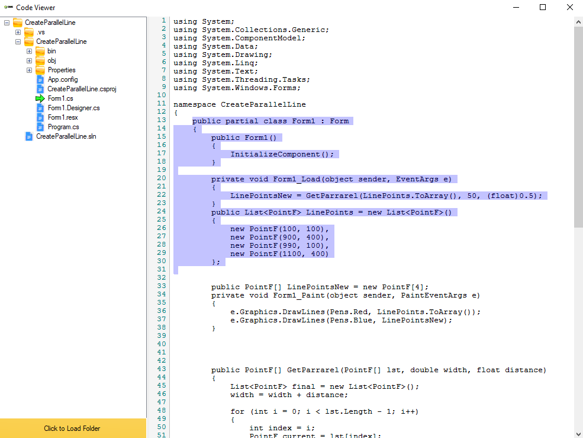

<!-- ABOUT THE PROJECT -->
## About The Project
This project will help you to view source any source code with treeview panel. 
Check It Out And Happy Coding!!! 
:-)

## Dependency
There are 2 libraries are used to implement this project which are 
1. [BetterFolderBrowser](https://www.nuget.org/packages/BetterFolderBrowser/) 
2. [FastColoredTextBox](https://www.nuget.org/packages/FastColoredTextBox) 

## Implementation

            var betterFolderBrowser = new BetterFolderBrowser();
            betterFolderBrowser.Title = "Select a folder...";
            betterFolderBrowser.RootFolder = "C:\\";
            betterFolderBrowser.Multiselect = false;
            if (betterFolderBrowser.ShowDialog() == DialogResult.OK)
                rootDirectory = betterFolderBrowser.SelectedFolder;
            if (String.IsNullOrEmpty(rootDirectory))
                return;
            treeViewControl = ListDirectory(treeViewControl, rootDirectory);
            
            
## Test (Setup File/ MSI file)
You can install this setup file for testing poupose. 
1. [Setup File](https://github.com/ThanbirTamim/CodeViewer/tree/main/CodeViewerSetup/Debug) 

## Output
Here is the screenshoot of expected output!

